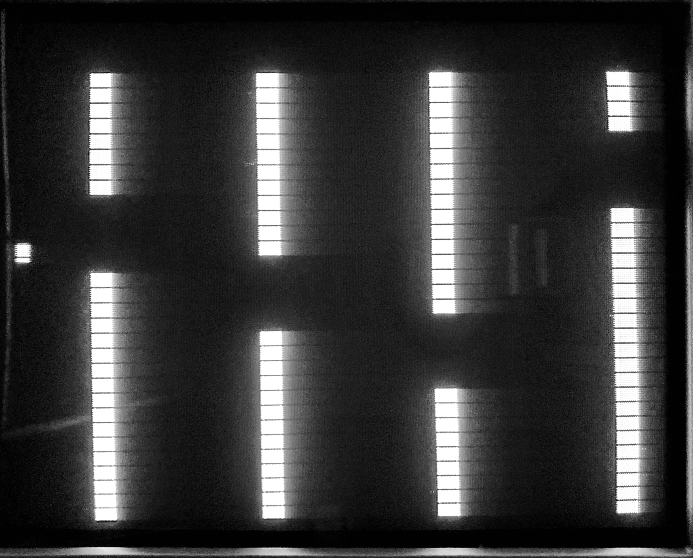

# TEXT-DEMO

## Screenshot

## About
This was a demo of a game running on the PIC16F84A. After figuring out how to create static images with the text demo, I decided to try my hand at making a game. And so, we now have *Flappy Bird* for the PIC16.

## Inner Workings
### Sync Generation
The sync generation is done by using the PIC's Timer 0 interrupt. Whenever the timer's interrupt fires, the interrupt routine starts a sync period. During the time that the sync is low, the code determines whether or not the current scanline should be in the Active Video Region and sets the flag accordingly. (AVR is bit 7 of `LINE_H`) At this point, the sync period is over, so the code releases the sync output and updates the line number.\
This is the same code as that in the `sync-base.asm` file example.

### Game Updates
To update the game variables, the `IVR_SERVICE` routine is called during the H-blanking interval. This deals with moving the pillars, moving the player, keeping score, button press timeouts, collision detection, and changing the game state.

### Line Rendering
The PIC is unfortunately not fast enough to actively compute the bit patterns for the characters during an active scanline. To get around this, at the beginning of `DISPLAY_LINE`, it checks to see if the line is a multiple of 8. If the line is, it jumps to `CALC_NEXT_LINE` to compute the bit patterns for the next 7 scanlines. This is what causes the horizontal blanking on the screen. If the line is not a multiple of 8, then the pattern stored in `PTRN_BUF` is output to the screen.\
The player is not computed in the `CALC_NEXT_LINE` routine. Instead, it is actively drawn as the line is being output to the screen, allowing for smooth motion of the player.

### Smooth Scrolling
In order to achieve smooth scrolling, every other frame the scanlines are shifted to the left by one machine cycle. After eight frames, `PTRN_BUF` is shifted left one bit and the cycle starts over.\
In order to draw the player brick without having it move back and forth as the screen is shifted, there is some code that delays the shifting until after the player has been drawn. (This is why there is a small "shadow" to the right of the player when it is near a pillar.)

## Assembling
To assemble the code, I use the MPLAB X IDE from Microchip. Create a new standalone project, using `pic-as` as the compiler toolchain. Once the project has been created, put the assembly file in the project's source folder. In the IDE, go to `Production > Set Project Configuration > Customize...` Then under `Categories`, go to `pic-as Global Options`. Here is an `Additional options` box, which needs the following arguments: `-Wa,-a -Wl,-pRESET_VEC=0h,-pISR_VEC=4h,-pLINE_DELAY=300h` to setup the correct locations for the PSECTS.

## Hardware
This runs on the same demo board as the sync- and text-demos. The only change is the addition of a normally-open push button that is connected between `PB0` and ground.
