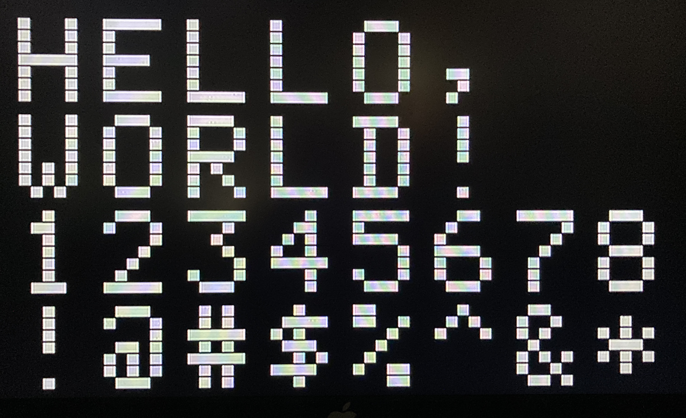

# TEXT-DEMO

## Screenshot

## About
This was a demo of generating text using the PIC16F84A on the breakout board also in this repository. It is capable of generating a 8x4 text array on the screen and reads incoming characters via a serial port.

## Features
- Reads characters off serial port (2400 BAUD) and displays them onto a TV screen
- Sending a `Tab` character (0x09) will clear the screen
- Sending a `'\n'` character (0x0a) will move the cursor to the next line
- Sending a `Backspace` character (0x08) will move the cursor back one character and erase that character

## Inner Workings
### Sync Generation
The sync generation is done by using the PIC's Timer 0 interrupt. Whenever the timer's interrupt fires, the interrupt routine starts a sync period. During the time that the sync is low, the code determines whether or not the current scanline should be in the Active Video Region and sets the flag accordingly. (AVR is bit 7 of `LINE_H`) At this point, the sync period is over, so the code releases the sync output and updates the line number.\
This is the same code as that in the `sync-base.asm` file example.

### Serial Port
The serial port operates at 2400 BAUD. The code samples the serial line each scanline. When the serial line goes low, the code counts five samples as an offset for sampling the other bits. If the line goes high during this period, it is treated as a false start and the code resets to a "no start detected" state. If the line stays low during the five sample timeout, then the timeout is increased to six cycles and every sixth cycle for the next eight bits, the serial line is sampled and its value shifted into the `IN_CHAR` variable. After the byte has been fully shifted in, the code resets its flags to "waiting for start bit."\
Why does this work? The horizontal scanline frequency for PAL is 15625 Hz and the bit frequency for a 2400 baud signal is 2400 Hz. Dividing these values gets about 6.51 lines per serial bit. By starting the sampling at an offset of 5 samples from the time that the start bit was detected, using a sampling rate of 6 scanlines means that each sample for each bit is within the bit period. (Personally, I would probably not use this on anything that was super data-critical, but for a simple TV-Typewriter project, it is more than adequate)

### Character Rendering
The PIC is unfortunately not fast enough to actively compute the bit patterns for the characters during an active scanline. To get around this, at the beginning of `DISPLAY_LINE`, it checks to see if the line is a multiple of 8. If the line is, it jumps to `CALC_NEXT_LINE` to compute the bit patterns for the next 7 scanlines. This is what causes the horizontal blanking on the screen. If the line is not a multiple of 8, then the pattern stored in `PTRN_BUF` is output to the screen.\
For computing the `PTRN_BUF` values, the routine `CALC_NEXT_LINE` uses a large (2-page) lookup table (`CHAR_LUT`). Since the character codes are rotated left three times when they are placed into the `CHARS` character array, the lowest bit is used to select the page for the lookup table.
