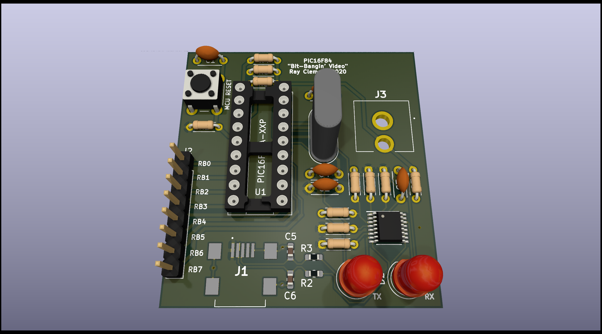

# PIC16F84A Breakout/Dev Board

## Screenshot

## Features
- Onboard FTDI USB to UART IC, connected to `PORTA[0..1]`
- `PORTB` breakout header
- Reset button
- Composite video out (RCA) jack with mixing resistors
